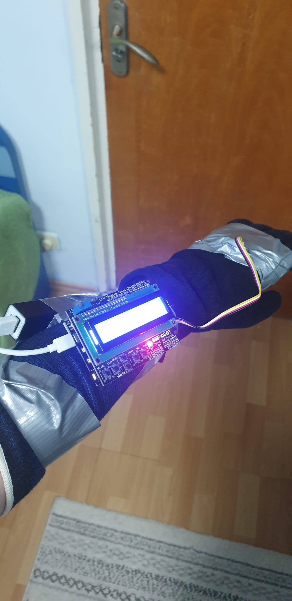
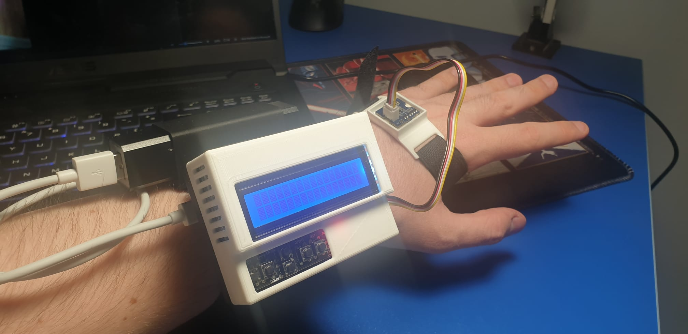
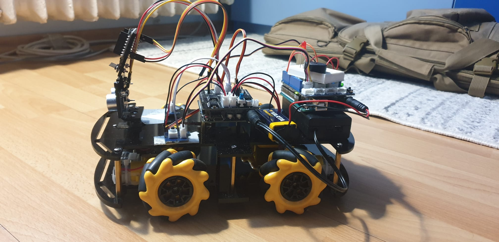

# C4T3-LU
This project is about controlling a robot car and other devices.
with the movements of an arm using hybrid Arduino and ESP8266 boards.

## Version 1 controller

## Version 2 controller

## Robot

